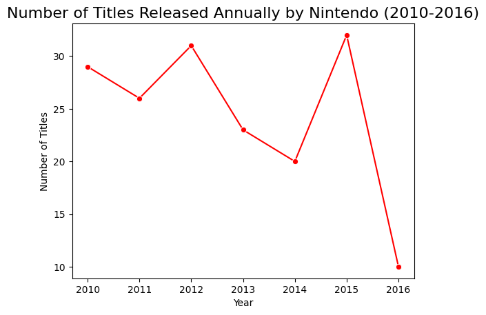
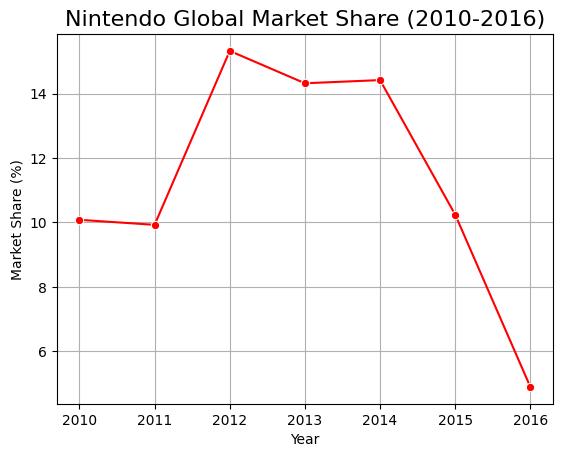
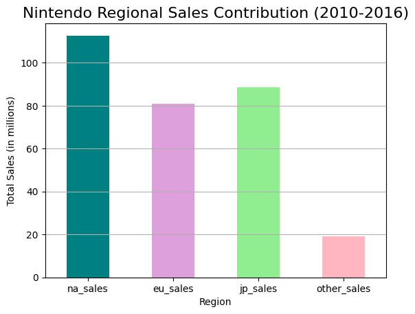
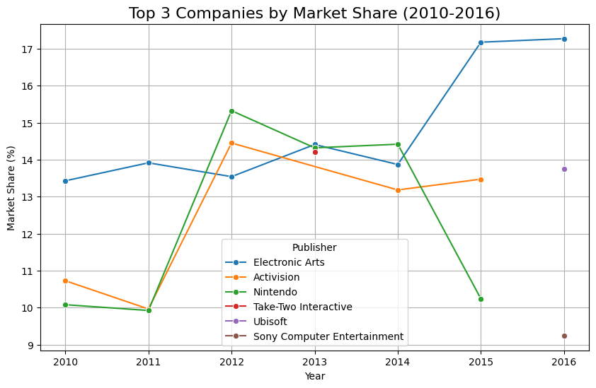
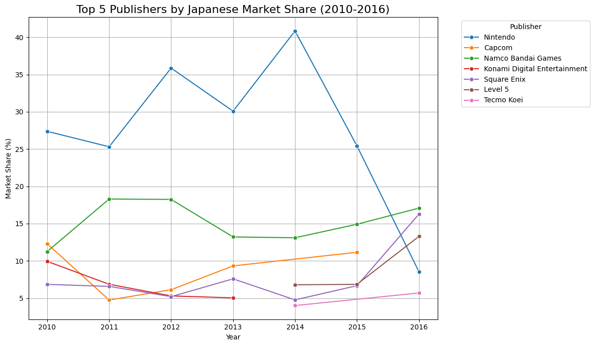
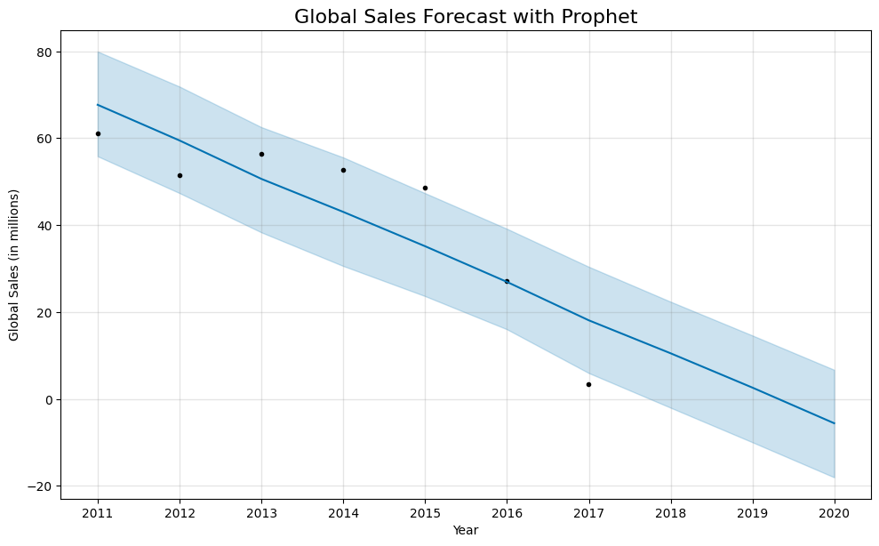

# Nintendo Market Analysis

## 📌 Project Overview
This project investigates why Nintendo’s global market share fluctuated between 2010–2016, identifies top-performing genres and regions, and builds predictive models to forecast sales and regional performance. It culminates in specific, actionable recommendations to grow market share.
----

## 📊 Dataset
That data set was sourced from [`Kaggle`](https://www.kaggle.com/datasets/sheemazain/video-game-sales-by-sheema-zain) with the following columns:

- Rank: The ranking of the game based on total global sales.
- Name: The title of the video game.
- Platform: The gaming system the game was released on (e.g., PlayStation, Xbox, Nintendo Switch, PC).
- Year_of_Release: The year the game was released.
- Genre: The category of the game (e.g., Action, Sports, RPG, Shooter).
- Publisher: The company responsible for publishing the game (e.g., Nintendo, Electronic Arts, Activision).
Sales figures are often segmented by region in millions of units: 7. NA_Sales: Sales in North America.
-EU_Sales: Sales in Europe.
- JP_Sales: Sales in Japan.
- Other_Sales: Sales in the rest of the world.****
- Global_Sales: Total worldwide sales (sum of all regions).

### 🗂️ Data Quality and Preparation Process
The csv file was imported in Postgres Admin after creating a Sales database, with a table being creaated to store the valeues.

```
-- This SQL statement creates a new table to store video game sales data.
CREATE TABLE video_game_sales (
    -- The primary key for the table. It stores the game's rank as an integer.
    Rank INT PRIMARY KEY,

    -- The name of the game. VARCHAR(255) is used to accommodate various title lengths.
    Name VARCHAR(255) NULL,

    -- The gaming platform (e.g., 'Wii', 'NES'). VARCHAR(50) should be sufficient.
    Platform VARCHAR(50) NULL,

    -- The year the game was released. INT is used for the year value.
    Year INT NULL,

    -- The genre of the game. VARCHAR(50) is used to store values like 'Sports' or 'Platform'.
    Genre VARCHAR(50) NULL,

    -- The publisher of the game. VARCHAR(255) is used for the company name.
    Publisher VARCHAR(255) NULL,

    -- North American sales in millions. DECIMAL(10, 2) allows for up to 10 total digits with 2 decimal places.
    NA_Sales DECIMAL(10, 2) NULL,

    -- European sales in millions.
    EU_Sales DECIMAL(10, 2) NULL,

    -- Japanese sales in millions.
    JP_Sales DECIMAL(10, 2) NULL,

    -- Other regional sales in millions.
    Other_Sales DECIMAL(10, 2) NULL,

    -- Global sales in millions.
    Global_Sales DECIMAL(10, 2) NULL
);

```


Since the data set was very large with over 16000 rows; it was checked for duplicates and nulls values. 

```
-- checking name duplicates --
select name, year, count(name)
from public.video_game_sales
group by name, year
having count(name) > 1
```

1. Trend analysis was crucial so it was essential to check for null values in the `Year` column. Duplicate game titles with missing null values were filled by a self join process to fill in the years.

```
-- using self join to find games that dropped the same year and updates the null values--
UPDATE public.video_game_sales AS g1
SET year = g2.known_year
FROM (
    SELECT 
        name, 
        MAX(year) AS known_year
    FROM public.video_game_sales
    WHERE year IS NOT NULL
    GROUP BY name
) AS g2
WHERE g1.name = g2.name AND g1.year IS NULL;
```
About 120 rows were updated through this process. the other few remaining null rows were deleted.

2. The same process was repeated for Publishers with null values with the remaining null values being set to unknown.
```
--finding similar publishers from games with missing values to grab publishers from other rows with same name--
UPDATE public.video_game_sales AS g1
SET publisher = g2.known_pub
FROM (
    SELECT
        name,
        MAX(publisher) AS known_pub
    FROM public.video_game_sales
    WHERE publisher IS NOT NULL
    GROUP BY name
) AS g2
WHERE g1.name = g2.name AND g1.publisher IS NULL;

-- the other 35 row are going to be set to unknown --
update public.video_game_sales
set publisher = 'Unknown'
where publisher is null;
```

- After completing cleaning the dataset the cleaned data sat was downloaded as a csv file for further analysis on python and predictive modelling


----
## 📌 Executive Summary

Context: EDA confirms fluctuating global market share for Nintendo from 2010–2016. Additionally,the most profitable markets for the publisher during that time period are North America, Japan, then Europe. Further insights are needed to diagnose the causes of this and the quality of the data for predictive modelling.

Focus Areas and Outcomes:

* Diagnose drivers of market share swings (titles, platform lifecycle, genre mix).

* Forecast global & regional sales.

* Predict regional performance for genres.

* Recommend levers to stabilize & grow market share.

## 🔍 Business Goals & Questions

Primary Goal: Improve Nintendo’s worldwide market share by prioritizing regions, genres, that maximize ROI.

Key Questions

1. How has Nintendo’s market share evolved annually since 2010, and what explains volatility?

2. Which regions (NA, JP, EU, Other) contribute most to sales, and where are the growth opportunities?

3. What is the forecast for total sales and regional sales over the next 3 years?

4. Given a future title’s attributes (platform, genre), what is its expected regional performance?

KPIs

* Global & regional unit sales (M).

* Annual market share (% of global industry sales).

* Title-level first-year sales (k units).

* Genre mix contribution (%) and ROI proxy.

----

## 📊 INSIGHTS

Based on the exploratory data analysis (EDA) of the video game sales dataset, the following insights regarding Nintendo's performance have been identified:

Significant Presence: Nintendo is a dominant publisher in the dataset. A high number of their titles appear in the top-selling charts, indicating a consistent output of commercially successful games across different platforms.

### Visual (Number of Titles Released

> The graph shows a fluctuating but generally high number of releases from 2010 to 2015, followed by a sharp decline in 2016. This decline coincides with the end of the Wii U's lifecycle and the lead-up to the launch of the Nintendo Switch in 2017.


### Visual (Nintendo Global Market Share (2010-2016))

> This graph shows a period of moderate market share from 2010-2011, a peak in 2012-2014, and a dramatic decrease from 2015-2016. This decline reflects possible commercial struggles in game titles or platform. Further analysis will be needed to understand the reason for a sharp decline.

### Visual(Nintendo Global Market Segment (2010 -2016))

> The chart clearly indicates that North America was the strongest market for Nintendo during the 2010-2016 period, followed by Japan and then Europe. Other regions contributed a significantly smaller amount to the total sales.

### Visual(Top 3 Companies by Global Market Share (2010 -2016))


Summary of the Data The graph tracks the market share of several major video game publishers and platform holders from 2010 to 2016.

* 2010-2011: Nintendo's market share was relatively stable, hovering around 10%.

* 2012: Nintendo saw a significant and dramatic increase in market share, peaking at over 15%. This was a high point for the company in this period and put them at the top of the charted companies for that year. This spike is consistent with the launch of the Wii U console in late 2012, which initially generated high sales.

* 2013-2014: Nintendo's market share began to decline, dropping from its peak but still remaining competitive at around 14% in 2014.

* 2015-2016: This is the most critical period shown in the graph. Nintendo's market share plummeted, dropping to just over 10% in 2015 and then falling to its lowest point on the chart in 2016 at just over 9%. During this time, rivals like Electronic Arts and Activision saw their market share either increase or remain relatively stable. The chart shows Electronic Arts surpassing Nintendo in 2015 and continuing to grow its lead in 2016.

* The overall trend for Nintendo from 2012 to 2016 is a sharp rise followed by a precipitous decline, which accurately reflects the commercial life cycle of the Wii U console.


### Visual(Top 5 Companies by Japanese Market Share (2010 -2016))


* The top 5 publishers by Japanese market share between 2010 and 2016 included Nintendo, Namco Bandai Games, Capcom, Konami Digital Entertainment, Square Enix, Level 5, and Tecmo Koei.
* Nintendo consistently ranked among the top publishers during the period.
* The specific publishers within the top 5 and their rankings varied from year to year.

### Visual(Top 5 Companies by Europe Market Share (2010 -2016))

The European market was particularly tough for Nintendo. While they had a brief peak, they were consistently outperformed by EA and Ubisoft. The graph shows EA's market share soaring in Europe from 2014-2016, reaching over 25% while Nintendo's dropped to single digits.

## Recommendations
1. Strengthen Third-Party and Indie Developer Relationships: The data shows that companies like EA and Activision maintained or increased their market share while Nintendo struggled. These companies' multi-platform blockbusters drove sales on competing consoles.
* Streamline development: Make it easier for third-party studios to port their games to Nintendo's hardware.

* Attract key franchises: Work with publishers to bring major AAA multi-platform titles to Nintendo's console, which helps to attract a different demographic of gamer.

* Court indie developers: The Switch has been a haven for indie games. By continuing to support and promote smaller studios, Nintendo can create a diverse library of content that appeals to a wide audience.

2. Optimize Regional Strategy, Especially in Europe: The graphs show that Europe was a particularly weak market for Nintendo during this period, with competitors like EA and Ubisoft dominating.
* Tailored marketing: Develop more targeted marketing campaigns that resonate with European gamers' preferences.

* Localization: Ensure that games are properly localized for different European languages and cultures to expand their appeal.

* Partnerships: Form strategic partnerships with European retailers and distributors to improve visibility and access to their products.

----

# Predictive modelling

The Prophet library was used to forecast Nintendo's global sales for the next three years, based on historical data from 2010 to 2016.

```

# **Q4: Sales Forecast for the next 3 years using Prophet**
nintendo_df = df[(df['publisher'] == 'Nintendo') & (df['year'].between(2010, 2016))].copy()
print("\n--- Forecasting Total & Regional Sales for the next 3 years using Prophet ---")
# Global Sales Forecast
prophet_df = nintendo_df.groupby('year')['global_sales'].sum().reset_index()
prophet_df['ds'] = pd.to_datetime(prophet_df['year'].astype(str) + '-12-31')
prophet_df['y'] = prophet_df['global_sales']

global_model = Prophet(changepoint_prior_scale=0.05, daily_seasonality=False)
global_model.fit(prophet_df)
future = global_model.make_future_dataframe(periods=3, freq='Y')
forecast_global = global_model.predict(future)

# Visualization
print("\nGlobal Sales Forecast:")
print(forecast_global[['ds', 'yhat', 'yhat_lower', 'yhat_upper']].tail(3).to_markdown(index=False, numalign="left", stralign="left"))
global_model.plot(forecast_global)
plt.title('Global Sales Forecast with Prophet', fontsize=16)
plt.xlabel('Year')
plt.ylabel('Global Sales (in millions)')
plt.show()

```

### Visual


* Downward Trend: The blue line in the chart represents the model's forecast. It shows a clear and steady decline in sales over the forecast period. This is because the model is primarily fitting a trend line to the decreasing sales data provided (from 2010 to 2016).

* Unrealistic Forecasts: The forecast predicts that Nintendo's global sales will continue to drop, even falling into negative values. This is not a realistic business outcome, as a company cannot have negative sales. This result indicates that the model is not a good fit for this data. Also the wider prediction interval shows the model is uncertain about future sales making it unfit for this data.

### Sales prediction Based on New Titles (Decision Making Forecast)

Another forecasting tool was created to identify to possible future sales that could be made on new titles based on genre and platform.

```
# **Q5: Predict a new title's regional performance?**
print("\n--- Predictive Model for New Title Performance (Random Forest Regressor) ---")

# Define features and targets
features = ['platform', 'genre']
target_regions = ['na_sales', 'eu_sales', 'jp_sales', 'other_sales']

# Handle categorical features using one-hot encoding
X = nintendo_df[features]
X_encoded = pd.get_dummies(X, columns=features, dtype=int)
y = nintendo_df[target_regions]

# Training a separate model for each target region
models = {}
for region in target_regions:
    y_target = y[region]
    X_train, X_test, y_train, y_test = train_test_split(X_encoded, y_target, test_size=0.2, random_state=42)

    # Initialize and train the Random Forest model
    model = RandomForestRegressor(n_estimators=100, random_state=42)
    model.fit(X_train, y_train)
    models[region] = model

    # Evaluate the model
    predictions = model.predict(X_test)
    mae = mean_absolute_error(y_test, predictions)
    print(f"Model for {region}: MAE = {mae:.2f} million units")

# --- 4. EXAMPLE PREDICTION FOR A NEW TITLE ---
print("\n--- Example Prediction for a Hypothetical New Title ---")

# Defining a hypothetical new game's attributes
new_game_data = {
    'platform': 'Wii-U',
    'genre': 'Platform'
}

# Create a DataFrame for the new game
new_game_df = pd.DataFrame([new_game_data])

# One-hot encode the new game data, aligning columns with the training data
new_game_encoded = pd.get_dummies(new_game_df, columns=features, dtype=int)
new_game_encoded = new_game_encoded.reindex(columns = X_encoded.columns, fill_value=0)

# Make predictions for each region
predictions = {region: models[region].predict(new_game_encoded)[0] for region in target_regions}
for region, sales in predictions.items():
    print(f"Predicted {region} sales: {sales:.2f} million units")
```
### Results

```
--- Predictive Model for New Title Performance (Random Forest Regressor) ---
Model for na_sales: MAE = 0.70 million units
Model for eu_sales: MAE = 0.49 million units
Model for jp_sales: MAE = 0.42 million units
Model for other_sales: MAE = 0.12 million units

--- Example Prediction for a Hypothetical New Title ---
Predicted na_sales sales: 1.10 million units
Predicted eu_sales sales: 0.54 million units
Predicted jp_sales sales: 0.58 million units
Predicted other_sales sales: 0.13 million units
```
> The MAE scores are relatively low, which is a positive sign. A low MAE suggests that the model's predictions are, on average, close to the actual sales numbers. The model performs best for other_sales and jp_sales, which means it is most accurate at predicting sales in those regions.

In this hypothetical scenario, the predictions suggest that a new Wii-U Platform game would sell best in the North American market, followed by Japan and Europe. The other_sales region is predicted to have the lowest sales, but as noted by the low MAE, the model is most confident in this prediction.

### Recommendations
* Allocate Marketing Resources: By knowing where a game is likely to perform best, Nintendo can focus its marketing budget on the most promising regions (e.g., North America).

* Identify Market Opportunities: The relatively high predicted sales in the North American market could signal an opportunity for more aggressive expansion or promotional campaigns.

* Inform Product Strategy: The model confirms that a Platform game on the Wii-U is a viable product, providing data-backed insights into future game development and release schedules

----


```
Author: Kwasi Dankwa
Role: Business Analyst
Nintendo (Portfolio Project)
Tech: SQL(PostGresAdmin), Python (pandas, scikit-learn), Jupyter, Views, Powerpoint
Business Window: 2010–2016
```
